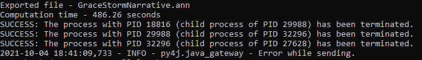
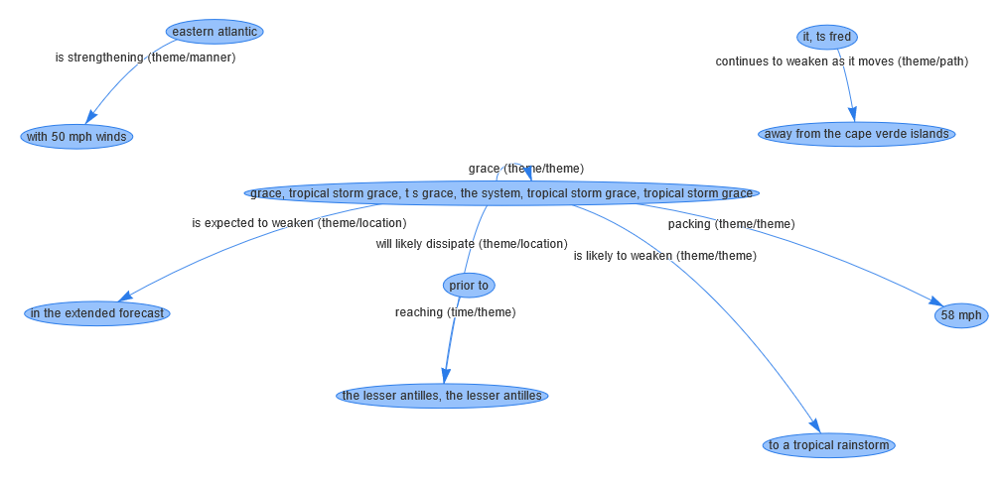
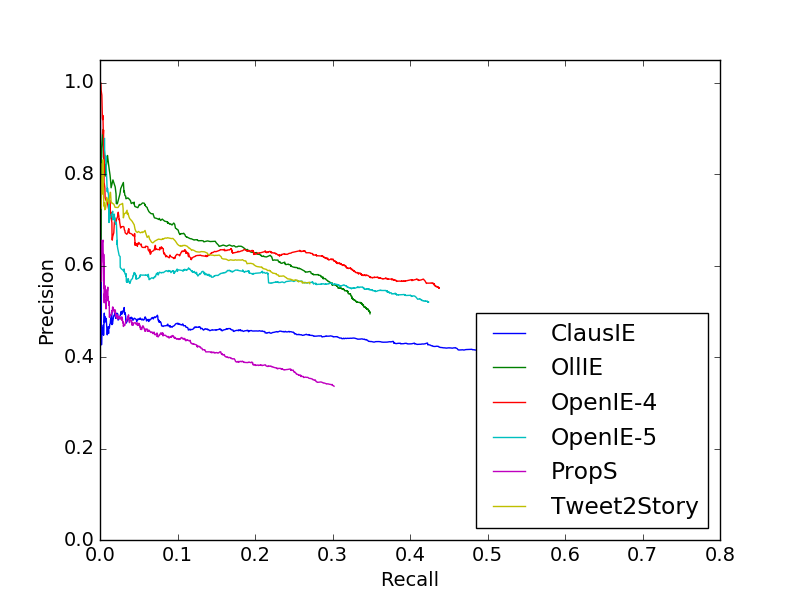
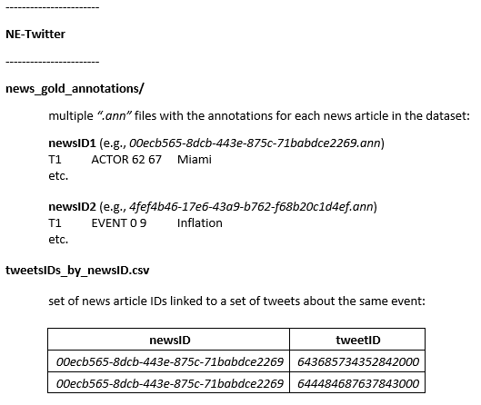

# Tweet2Story


*Tweet2Story* is a framework to **automatically extract narratives** from sets of Tweets. Despite the focus on tweets, it can also be used to extract narratives from regular texts. The tool performs a set of Natural Language Processing tasks, in order to transform the texts it receives into [brat style annotations](https://brat.nlplab.org/standoff.html).

The tool was tested on a certain set of tweets retrieved from the [Signal1M-tweetir](https://research.signal-ai.com/datasets/signal1m-tweetir.html) dataset. This dataset consists on sets of tweets about an event **linked** to a news article about the same event. The tests consisted on empirical evaluation and on comparing the narrative from the tweets - extracted with Tweet2Story - with the narrative from the news article - annotated by an expert linguist.

To add some consistency to the evaluation, we tested its performance as an OpenIE (Open Information Extraction) tool.
We perform this evaluation using [CaRB](https://aclanthology.org/D19-1651/) and test the Tweet2Story framework against state-of-the-art OpenIE tools.

Taking this into account, this repository provides **three** things:

* [The Tweet2Story framework.](#how-to-use-tweet2story)
* [The evaluation of the framework as an OpenIE tool](#evaluation-as-openie-tool)
* [The news articles annotated by the expert linguist (gold annotations).](#gold-annotations-dataset)

Lastly, this repository also contains the current version of the short paper about the Tweet2Story framework that will be submitted to the [ECIR 2022](https://ecir2022.org/).

## How to use Tweet2Story

------

This framework extracts the narrative of any document in a text file (.txt) from the directory _"Data/input_files"_ into an annotation file (.ann) to the _"Data/auto_ann"_ directory.

### Tweet2Story structure

-------

This framework follows a structure developed together with Pedro Mota (<up201805248@up.pt>) for the [Text2Story](https://text2story.inesctec.pt/) project.

```
.
│   README.md
|   env.yml
│   requirements.txt
|
└──Tweet2Story
    └──Text2Story
        └──core
        │   │   annotator.py (META-annotator)
        │   │   entity_structures.py (ActorEntity, TimexEntity and EventEntity classes)
        │   |   exceptions.py (Exceptions raised by the package)
        │   |   link_structures.py (TemporalLink, AspectualLink, SubordinationLink, SemanticRoleLink and ObjectalLink classes)
        │   |   narrative.py (Narrative class)
        │   |   utils.py (Utility functions)
        │   
        └───annotators (tools supported by the package to do the extractions)
        |   |   ALLENNLP
        |   |   NLTK
        |   │   PY_HEIDELTIME
        |   |   SPACY
        |   |   SPARKNLP
    
    └── Data
          └──auto_ann (Directory where the narratives are extracted to)
          |  |  GraceStormNarrative.ann (example annotation file)
          |
          └───input_files (Directory where the input files for Tweet2Story need to be)
          |  |  GraceStormTweets.txt (example tweets text file)

```

### <a id="t2s-usage"></a>Usage

-----

Create a virtual environment to run the tool.

```bash
conda env create -f env.yml
conda activate t2s
pip install --user -r requirements.txt
```

Basic usage of Tweet2Story:
1. Store a .txt file with the tweets on the _"Data/input_files/"_ directory;
2. ```bash
    cd Tweet2Story
    python -m text2story "GraceStormTweets.txt" -o "GraceStormNarrative.ann"
   ```

The framework is computationally intensive, therefore it takes **~5 minutes** to extract a narrative.<br>
The file with the narrative in the form of annotation (.ann) is stored in the *"Data/auto_ann/"* directory.

### Input File Format

-----

The input file must be stored in the *"Data/input_files/"* directory. Each tweet must be separated by a new line.

The lines below are an example of an input file, which is stored in the *input_files* directory with the name *GraceStormTweets.txt*:

``````
grace is likely to weaken to a tropical rainstorm prior to reaching the lesser antilles.
tropical storm grace packing wind gusts of 58 mph.
tropical storm grace will likely dissipate east of the lesser antilles.
``````

### Known bug

-----

In this release, the program does not exit after finishing extracting and exporting the narrative.
So when you see this after running the program:



It means Tweet2Story has finished its job, and you can **manually** terminate the process (using CTRL+C for example). If more than 7-8 minutes have passed after the execution of the program, it most likely already finish. You can check the _"Data/auto_ann/"_ directory to confirm if the narrative has already been extracted.<br>

**Do not be alarmed by the large amount of command line output, the program is functioning normally.**

### Narrative Visualization

-----

At this point, the narrative visualization through knowledge graphs is not implemented in this framework automatically.
**However**, you can check some knowledge graphs of narratives extracted from Tweet2Story on the [Brat2Viz page](https://nabu.dcc.fc.up.pt/brat2viz).

The full integration of the Brat2Viz knowledge graphs are a future direction for this tools.
An example of how the knowledge graph for the example in this repository turned out is shown below.



## Evaluation as OpenIE tool

-----

To perform an evaluation against other state-of-the art tools, we took advantage of a pre-existing benchmark framework to evaluate OpenIE tools - [CaRB](https://aclanthology.org/D19-1651/).

First, we ran Tweet2Story over the CaRB data, which created the results of the tool on this benchmark (extracted the triples from the CaRB gold dataset).
They are stored in *"CaRB/system_outputs/test/tweet2story_output.txt"*. 
Using this output, we can run the [CaRB evaluator](https://github.com/dair-iitd/CaRB) released under an MIT license.

In this repository, we use the CaRB tool stored in the *"evaluation/"* directory to calculate the precision and recall of Tweet2Story as an OpenIE tool and plot a PR-curve that shows that performance.

### Usage

-----

**If you want to run Tweet2Story on the CaRB data you can follow these steps, but be warned that it takes around 7~10 minutes to run:**
1. Make sure you have the virtual environment required to use [Tweet2Story](#t2s-usage).
2. Go to evaluation directory - `cd evaluation`
3. `python create_carb_output.py`
4. The output is stored in *evaluation/CaRB/system_outputs/test/tweet2story_output.txt*.

**If you want you can skip the previous step, we already provide the output file.**
We suggest using the virtual environment created to run the Tweet2Story framework to run the previous script.

**To run the CaRB evaluator, we suggest you create a new python virtual environment.**
Some packages have conflicting dependencies with Tweet2Story and can cause errors with the CaRB evaluator.

Follow these steps to evaluate Tweet2Story:
1. Go to the CaRB directory - `cd evaluation/CaRB`
2. Create a new virtual environment and install the requirements - `pip install -r requirements.txt`
3. ```bash
   python carb.py --gold=data/gold/test.tsv --out=dump/Tweet2Story.dat --tabbed=system_outputs/test/tweet2story_output.txt
   ```

This evaluates Tweet2Story against the gold dataset of CaRB and stores the results in *Tweet2Story.dat*.

Lastly, we create a PR-curve that showcases the results against other tools. 
The results for each tool are stored in the *dump/* directory. 
Follow these steps to create the curve:

1. Follow the previous steps to create the *Tweet2Story.dat* file.
2. From the *CaRB/* directory run:
```bash
python pr_plot.py --in=dump/ --out=graphs/Tweet2Story.png
```

### Results

-----

**In case you can't, or you do not want to create a new environment and run the CaRB evaluation tool, this repository already contains the results produced by it.**

The Tweet2Story results file is stored in *evaluation/CaRB/dump/Tweet2Story.dat*.
The PR-curve can be is stored in *evaluation/CaRB/graphs/Tweet2Story.png* and looks like this:



-----

**For more information on the CaRB tool you can check out the author's [README](evaluation/CaRB/README.md), as well as their [paper](https://aclanthology.org/D19-1651/) and [repository](https://github.com/dair-iitd/CaRB).**

## Gold annotations dataset

### Definition

-----

The gold annotations dataset contains a set of **48 news articles** and **564 tweets** retrieved from the [Signal1M-tweetir](https://research.signal-ai.com/datasets/signal1m-tweetir.html) dataset. The articles are exclusively in **English** and as stated by [Signal](https://research.signal-ai.com/datasets/signal1m.html), they are collected from a variety of news sources. Each article was curated by a pre-processing pipeline that removed unnecessary parts of the text, such as links. Finally, the texts were annotated by an expert linguist using the [brat style annotations](https://brat.nlplab.org/standoff.html).

### Dataset Structure

-------------------

The gold annotations dataset, we named it NE-Twitter (NE for Narrative Extraction) for simplicity, has a simple structure. It contains a folder with the brat style annotated narratives from each article and a csv file with the tweets IDs linked to their respective news article ID, both about the same event.

 


### Why should you use it

-----

There are no other dataset that we know of (as of August 25, 2021) that provide annotated news articles by an expert linguist in the brat format.

The automatic extraction of narratives is a current task where you can use this dataset. The annotations could be used as input and training data for models, or their structure can be used to make new custom annotations adapted to your needs. On another hand, the comparison of the narrative of news articles about an event with social media posts about the same event is also an interesting study and one can use these annotations to compare the narratives from both sides.


### How to reproduce the dataset

---

The dataset is created through the [Signal1M](https://research.signal-ai.com/datasets/signal1m.html) dataset where we get the news articles and by the [Twitter API](https://developer.twitter.com/en/docs/twitter-api) where we get the tweets. To retrieve the data from the Signal1M dataset, it is best to follow the steps in this [tutorial](https://github.com/signal-ai/Signal-1M-Tools), which uses Elasticsearch to collect the news articles (since the original dataset is quite large in size).

The tweets can be collected by hydrating them from the Twitter API. Simply install the [Twarc](https://github.com/DocNow/twarc) utility using pip and run the following command, where the "tweetIDs.txt" contains a list of the list of tweet IDs in the dataset. This command will extract the JSON response from the Twitter API.

```python
!twarc hydrate tweetIDs.txt > tweets.jsonl
```

Note: You will need to have a Twitter API token and a Twitter API secret to be able to use the Twitter API and twarc.


## Acknowledgements

Special thanks to both my master thesis supervisors: professor Ricardo Campos and professor Alípio Jorge.

A big thanks to my colleague Pedro Mota for helping with the structure of the framework. And a word of thanks and appreciation to Inês Cantante for providing the annotations of the news articles in the gold annotations dataset.

## Contact

For further information related to this dataset please contact Vasco Campos using the e-mail address <vasco.m.campos@inesctec.pt>.

